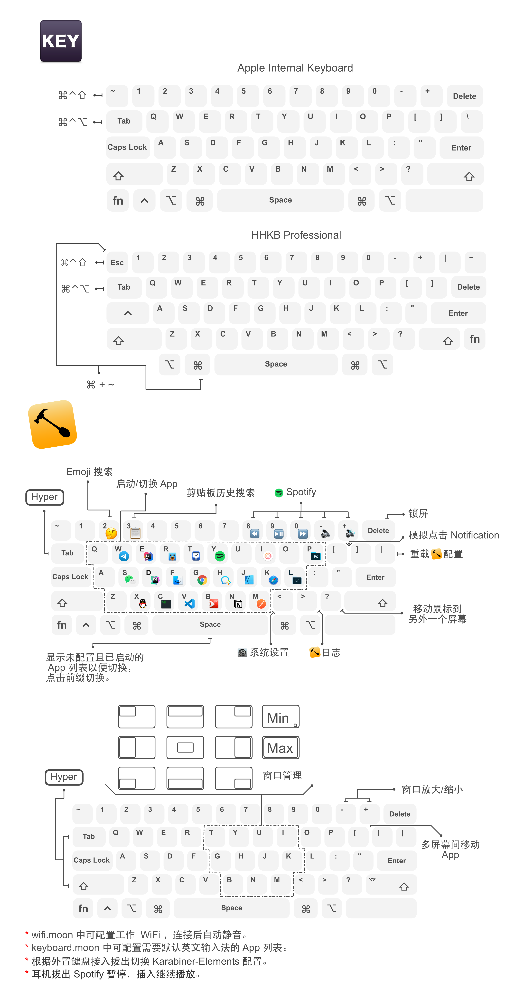
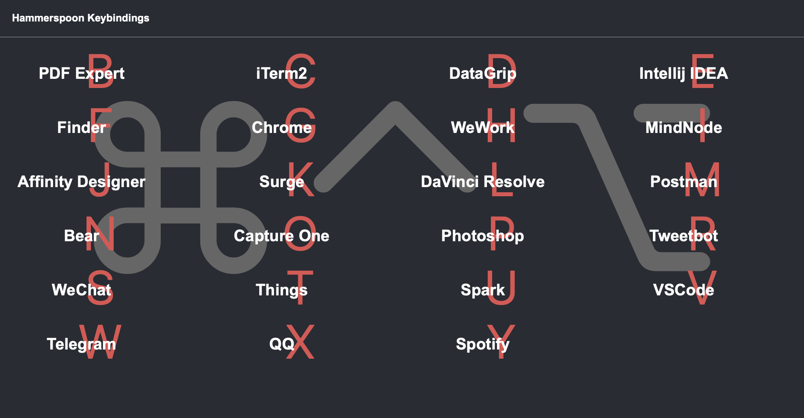

## Install

***NOW CAN USE HOMEBREW INSTALL LUA***
1.  `$ luarocks --lua-version 5.4 install moonscript`
2.  `$ luarocks --lua-version 5.4 install lodash`
3.  Download [SpoonInstall](https://github.com/Hammerspoon/Spoons/raw/master/Spoons/SpoonInstall.spoon.zip) and put it `../Spoons/`
4.  Keyboard moudle needs to config your own keyboard's sourceID

## Function

Karabiner-Elements:
- Change `Tab` to `cmd+alt+ctrl` if pressed with other keys
- Change `Command + Esc` to `Command + ` ` (convenient for HHKB)
- Change `Esc` to `cmd+shift+ctrl` if pressed with other keys (convenient for HHKB)
- Change `grave_accent_and_tilde` to `cmd+shift+ctrl` if pressed with other keys (convenient for Apple Internal Keyboard)

### Launchpad

Hotkey: `⌘⌃⌥` (Change to `Tab`)

Launch or switch app, the mouse will move to the window of the application.

- `a-z` : launch app (appMap)
- `8` : previous (Spotify)
- `9` : pause (Spotify)
- `0` : next (Spotify)
- `-` : volume down (Spotify)
- `=` : volume up (Spotify)
- `[` : click Notification up
- `]` : click Notification down
- `\` : reload HammerSpoon's config
- `/` : move mouse to next screen
- `,` : launch System Preferences
- `.` : toggle HammerSpoon's console
- `2` : search Emoji
- `3` : search Clipboard
- `Space` : show app not in `appMap` or `blacklist`, if some apps are running, but no windows - force create one
- `delete` : lock screen

### Window Layout

Hotkey: `⌘⌃⌥⇧` (Change to `Tab + shift`)

- `t` : leftUp
- `g` : leftHalf
- `b` : leftDown
- `y` : upHalf
- `h` : center
- `n` : downHalf
- `u` : rightUp
- `j` : rightHalf
- `m` : rightDown
- `k` : maximize
- `i` : minimize
- `space` : switch between maximize and center
- `[` : previous screen
- `]` : next screen
- `-` : smaller
- `=` : larger

Learn more from `key.moon`

### Keyboard Switch

This is just for mother tongue is not English, application's Bundle identifier(Bundle ID or App ID, in info.plist) is configed will switch to ABC.